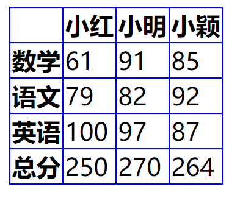

# HTML常用标签
## 一. a 标签的用法
### 1. 属性
* href
	* 网址
		* https://google.com
		* http://google.com
		* //google.com
		```
		<!-- 这种最高级，自动选择是使用http还是https，因为如果我们在不确定的情况下，把两者写错，会报错的 -->
		<a href="//google.com" target="_blank">超链接</a>
		```
	* 路径
		* /a/b/c以及 a/b/c
		* index.html 以及./index.html
	* 伪协议
		* javascript：代码;
		```
		    <!--做一个点击之后没有动作的a标签-->
   			 <a href="javascript:;">空伪协议</a>
		```
		* mailto：邮箱;
		```
		    <a href="mailto:zhouxiaomin01@126.com">发邮件给我</a>
		```
		* tel：手机号;
		```
		    <a href="tel:18840632773">打电话给我</a>
		```
	* id
		```
		<a href="#15">查看id=15的标签</a>
		```
* target
	* 内置名字
		* _blank
		* top
		* _parent
		* _self
	* 程序员命名
		* window的name
		 
		 用同一个窗口打开不同的页面
		 ```
		     <a href="//baidu.com" target="zxm">百度</a>
   			 <a href="//google.com" target="zxm">谷歌</a>
		 ```
		* iframe的name
		```
		<!-- 可以做一个切换百度和谷歌浏览器的页面 -->
		<body>
		    <!-- 这里的zxm 可以随便换名字，如：xxx,yy 等等任意 -->
			<a href="//baidu.com" target="zxm">百度</a>
			<a href="//google.com" target="zxm">谷歌</a>

			<iframe style="border: none; width:100%; height: 800px" src="//baidu.com" name="zxm">百度</iframe>
		</body>
		```
* download
* rel=noopener
防止一个bug的。
### 2. 作用
* 跳转外部页面
* 跳转内部锚点
* 跳转到邮箱或电话等
## 二. img 标签的用法

* 作用

	发出get请求，展示一张图片
* 属性

	alt/height/width/src
* 事件

	onload/onerror.
* 响应式

	max-width：100%

## 三. table 标签的用法
```
<!DOCTYPE html>
<html lang="en">
<head>
    <meta charset="UTF-8">
    <meta name="viewport" content="width=device-width, initial-scale=1.0">
    <title>Table 标签</title>
    <link rel="stylesheet" href="style.css">
</head>
<body>
    <table>
        <thead>
            <!-- tr: table row -->
            <tr>
                <!-- 表头 -->
                <th></th>
                <th>小红</th>
                <th>小明</th>
                <th>小颖</th>
            </tr> 
        </thead>
        <tbody>
            <tr>
                <th>数学</th>
                <td>61</td>
                <td>91</td>
                <td>85</td>
            </tr>
            <tr>
                <th>语文</th>
                <td>79</td>
                <td>82</td>
                <td>92</td>
            </tr>
            <tr>
                <th>英语</th>
                <td>100</td>
                <td>97</td>
                <td>87</td>
            </tr>            
        </tbody>
        <tfoot>
            <tr>
                <th>总分</th>
                <td>250</td>
                <td>270</td>
                <td>264</td>
            </tr>
        </tfoot>
    </table> 
</body>
</html>
```
```CSS
/*CSS 代码*/
table{
    /* 自动计算宽、高，取决于包含的内容 */
    /* fixed 平均列宽 */
    table-layout: auto;
    /* 合并 */
    border-collapse: collapse;
    border-spacing: 0;
}
td,th{
    border: solid 1px blue;
}
```
效果图：



## 四. form标签

* 作用

	发get或post请求，然后刷新页面
* 属性
	* action :请求哪个页面
	* autocomplete :是否自动填充 (on off)
	* method :请求的方法(GET POST)
	* target
* 事件

	onsubmit
* 注意事项
	* 一般不监听input的click事件
	* form 里面的input要有name
	* form里要放一个type=submit才能触发submit事件
